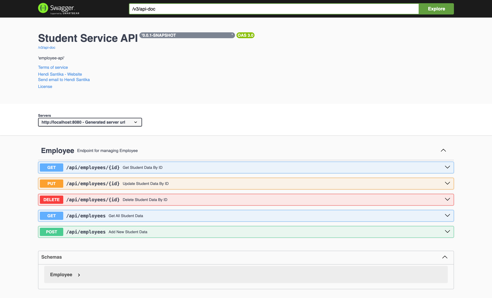

# employee-api

This is Backend Repository for Front end UI.
Check this Front End Repository --> https://github.com/hendisantika/react-front-end.git

### Things todo list

1. Clone this repository: `git clone https://github.com/hendisantika/employee-api.git`
2. Navigate to the folder: `cd employee-api`
3. Run the application: `mvn clean spring-boot:run`
4. Open Your favorite browser: http://localhost:8080/swagger-ui

### Swagger UI

